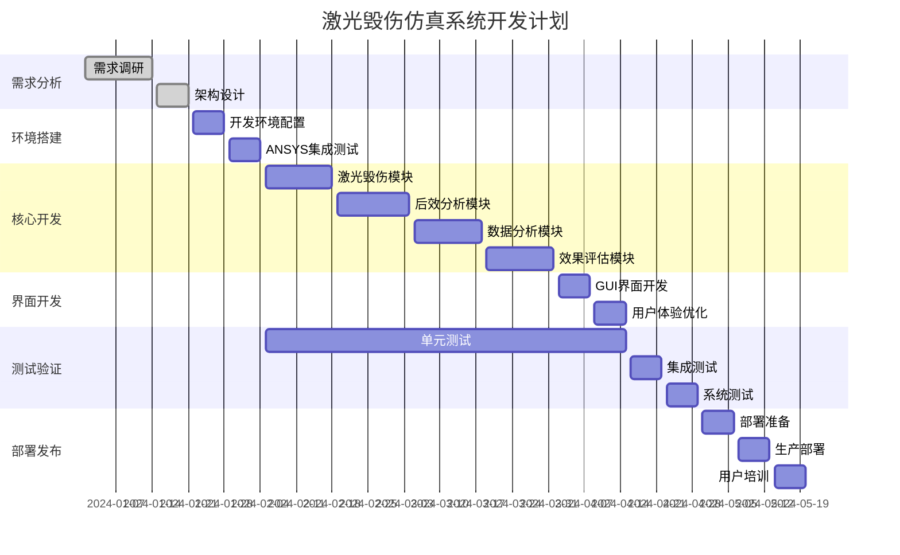

# 基于ANSYS 2021 R1的激光毁伤仿真系统开发方案

## 1. 项目概述

### 1.1 项目背景
本项目旨在开发一套基于ANSYS 2021 R1的激光毁伤仿真系统，实现激光武器对目标的毁伤效果仿真、后效分析、数据处理和效果评估的完整工作流程。

### 1.2 核心功能模块
根据需求分析，系统包含四大核心模块：
1. **激光毁伤仿真模块** - 热损伤仿真、热应力计算
2. **毁伤后效分析模块** - 飞行状态仿真、网格分析
3. **数据分析与报告生成模块** - 结果提取、可视化、报告生成
4. **激光毁伤效果评估模块** - 综合毁伤效果评估

## 2. 系统架构设计

### 2.1 整体架构
```
┌─────────────────────────────────────────────────────────────┐
│                    用户界面层 (UI Layer)                      │
├─────────────────────────────────────────────────────────────┤
│                   业务逻辑层 (Business Layer)                 │
│  ┌─────────────┐ ┌─────────────┐ ┌─────────────┐ ┌─────────┐ │
│  │激光毁伤仿真 │ │毁伤后效分析 │ │数据分析报告 │ │效果评估 │ │
│  │   模块      │ │   模块      │ │生成模块     │ │  模块   │ │
│  └─────────────┘ └─────────────┘ └─────────────┘ └─────────┘ │
├─────────────────────────────────────────────────────────────┤
│                   数据访问层 (Data Layer)                     │
│  ┌─────────────┐ ┌─────────────┐ ┌─────────────┐ ┌─────────┐ │
│  │模型数据管理 │ │仿真参数管理 │ │结果数据管理 │ │配置管理 │ │
│  └─────────────┘ └─────────────┘ └─────────────┘ └─────────┘ │
├─────────────────────────────────────────────────────────────┤
│                 ANSYS集成层 (ANSYS Integration)               │
│  ┌─────────────┐ ┌─────────────┐ ┌─────────────┐            │
│  │  Mechanical │ │   Fluent    │ │   Workbench │            │
│  └─────────────┘ └─────────────┘ └─────────────┘            │
└─────────────────────────────────────────────────────────────┘
```

### 2.2 技术栈选择
- **仿真引擎**: ANSYS 2021 R1 (Mechanical, Fluent, Workbench)
- **开发语言**: Python 3.8+ (主要), APDL脚本
- **GUI框架**: PyQt5/PySide2 或 Tkinter
- **数据处理**: NumPy, Pandas, SciPy
- **可视化**: Matplotlib, PyVista, VTK
- **报告生成**: ReportLab, Jinja2
- **数据库**: SQLite (轻量级) 或 PostgreSQL (企业级)
- **版本控制**: Git
- **文档**: Sphinx

## 3. 环境搭建方案

### 3.1 基础环境要求
```yaml
操作系统: Windows 10/11 (64位) 或 Linux RHEL/CentOS 7+
内存: 16GB+ (推荐32GB)
存储: 500GB+ SSD
CPU: Intel i7/Xeon 或 AMD Ryzen 7+
GPU: NVIDIA Quadro/Tesla (可选，用于GPU加速)
```

### 3.2 软件环境配置
```bash
# ANSYS 2021 R1 安装路径
ANSYS_ROOT=/opt/ansys_inc/v211  # Linux
# 或 C:\Program Files\ANSYS Inc\v211  # Windows

# Python环境配置
Python 3.8.10+
pip 21.0+
virtualenv 或 conda
```

### 3.3 依赖库清单
```python
# 核心依赖
ansys-mapdl-core>=0.60.0
ansys-fluent-core>=0.12.0
pyansys>=0.61.0

# 数据处理
numpy>=1.21.0
pandas>=1.3.0
scipy>=1.7.0

# 可视化
matplotlib>=3.4.0
pyvista>=0.32.0
vtk>=9.0.0

# GUI开发
PyQt5>=5.15.0
# 或 PySide2>=5.15.0

# 报告生成
reportlab>=3.6.0
jinja2>=3.0.0

# 数据库
sqlalchemy>=1.4.0
sqlite3 (内置)

# 测试框架
pytest>=6.2.0
pytest-cov>=2.12.0
```

## 4. 模块划分与详细设计

### 4.1 激光毁伤仿真模块 (LaserDamageSimulation)

#### 4.1.1 模块职责
- 3D模型加载与前处理
- 激光参数配置（功率、波长、光斑大小等）
- 材料热物性参数设置
- 环境条件参数设置
- 热传导仿真计算
- 热应力分析计算

#### 4.1.2 核心类设计
```python
class LaserDamageSimulator:
    """激光毁伤仿真主控制器"""
    
    def __init__(self):
        self.model_loader = ModelLoader()
        self.laser_config = LaserConfiguration()
        self.material_config = MaterialConfiguration()
        self.environment_config = EnvironmentConfiguration()
        self.thermal_solver = ThermalSolver()
        self.stress_solver = StressSolver()
    
    def load_model(self, model_path: str) -> bool
    def configure_laser_parameters(self, params: dict) -> bool
    def configure_material_properties(self, materials: dict) -> bool
    def configure_environment(self, env_params: dict) -> bool
    def run_thermal_simulation(self) -> SimulationResult
    def run_stress_analysis(self) -> SimulationResult
    def export_results(self, output_path: str) -> bool

class LaserConfiguration:
    """激光参数配置类"""
    power: float          # 激光功率 (W)
    wavelength: float     # 波长 (nm)
    beam_diameter: float  # 光斑直径 (mm)
    pulse_duration: float # 脉冲持续时间 (s)
    repetition_rate: float # 重复频率 (Hz)
    
class MaterialConfiguration:
    """材料参数配置类"""
    thermal_conductivity: float  # 热导率
    specific_heat: float         # 比热容
    density: float              # 密度
    melting_point: float        # 熔点
    absorption_coefficient: float # 吸收系数
```

### 4.2 毁伤后效分析模块 (PostDamageAnalysis)

#### 4.2.1 模块职责
- 毁伤后模型状态分析
- 飞行状态参数设置
- 动网格划分与优化
- 流体动力学仿真
- 结构完整性分析

#### 4.2.2 核心类设计
```python
class PostDamageAnalyzer:
    """毁伤后效分析主控制器"""
    
    def __init__(self):
        self.flight_config = FlightConfiguration()
        self.mesh_generator = MeshGenerator()
        self.fluid_solver = FluidSolver()
        self.structural_analyzer = StructuralAnalyzer()
    
    def load_damaged_model(self, model_path: str) -> bool
    def configure_flight_conditions(self, flight_params: dict) -> bool
    def generate_mesh(self, mesh_params: dict) -> bool
    def run_aerodynamic_simulation(self) -> SimulationResult
    def analyze_structural_integrity(self) -> AnalysisResult

class FlightConfiguration:
    """飞行状态配置类"""
    altitude: float      # 飞行高度 (m)
    mach_number: float   # 马赫数
    angle_of_attack: float # 攻角 (度)
    sideslip_angle: float  # 侧滑角 (度)
    atmospheric_model: str # 大气模型

### 4.3 数据分析与报告生成模块 (DataAnalysisReporting)

#### 4.3.1 模块职责
- 仿真结果数据提取与解析
- 数据可视化图表生成
- 统计分析与趋势分析
- 自动化报告生成
- 多格式导出支持

#### 4.3.2 核心类设计
```python
class DataAnalysisReporter:
    """数据分析与报告生成主控制器"""

    def __init__(self):
        self.data_extractor = DataExtractor()
        self.data_processor = DataProcessor()
        self.chart_generator = ChartGenerator()
        self.report_generator = ReportGenerator()

    def extract_simulation_data(self, result_files: list) -> DataFrame
    def process_data(self, raw_data: DataFrame) -> ProcessedData
    def generate_charts(self, data: ProcessedData) -> list
    def generate_report(self, template: str, data: dict) -> str
    def export_report(self, report: str, format: str) -> bool

class DataExtractor:
    """数据提取器"""

    def extract_thermal_data(self, result_file: str) -> dict
    def extract_stress_data(self, result_file: str) -> dict
    def extract_flow_data(self, result_file: str) -> dict
    def extract_displacement_data(self, result_file: str) -> dict

class ChartGenerator:
    """图表生成器"""

    def create_temperature_contour(self, data: dict) -> Figure
    def create_stress_distribution(self, data: dict) -> Figure
    def create_damage_progression(self, data: dict) -> Figure
    def create_performance_comparison(self, data: dict) -> Figure
```

### 4.4 激光毁伤效果评估模块 (DamageEffectAssessment)

#### 4.4.1 模块职责
- 毁伤程度量化评估
- 多维度效果分析
- 毁伤阈值判定
- 效果等级分类
- 综合评估报告

#### 4.4.2 核心类设计
```python
class DamageEffectAssessor:
    """毁伤效果评估主控制器"""

    def __init__(self):
        self.damage_calculator = DamageCalculator()
        self.threshold_analyzer = ThresholdAnalyzer()
        self.effect_classifier = EffectClassifier()
        self.assessment_reporter = AssessmentReporter()

    def calculate_damage_metrics(self, simulation_data: dict) -> DamageMetrics
    def analyze_damage_thresholds(self, metrics: DamageMetrics) -> ThresholdAnalysis
    def classify_damage_level(self, analysis: ThresholdAnalysis) -> DamageLevel
    def generate_assessment_report(self, level: DamageLevel) -> AssessmentReport

class DamageMetrics:
    """毁伤指标类"""
    thermal_damage_area: float    # 热损伤面积
    melting_volume: float         # 熔化体积
    stress_concentration: float   # 应力集中系数
    structural_integrity: float   # 结构完整性指数
    aerodynamic_impact: float     # 气动性能影响

class DamageLevel(Enum):
    """毁伤等级枚举"""
    MINIMAL = "轻微毁伤"
    MODERATE = "中等毁伤"
    SEVERE = "严重毁伤"
    CRITICAL = "致命毁伤"
```

## 5. 项目结构与代码布局设计

### 5.1 项目目录结构
```
laser_damage_simulation/
├── README.md
├── requirements.txt
├── setup.py
├── config/
│   ├── __init__.py
│   ├── settings.py
│   ├── ansys_config.yaml
│   └── logging_config.yaml
├── src/
│   ├── __init__.py
│   ├── core/
│   │   ├── __init__.py
│   │   ├── base_simulator.py
│   │   ├── data_models.py
│   │   └── exceptions.py
│   ├── laser_damage/
│   │   ├── __init__.py
│   │   ├── simulator.py
│   │   ├── laser_config.py
│   │   ├── material_config.py
│   │   ├── thermal_solver.py
│   │   └── stress_solver.py
│   ├── post_damage/
│   │   ├── __init__.py
│   │   ├── analyzer.py
│   │   ├── flight_config.py
│   │   ├── mesh_generator.py
│   │   ├── fluid_solver.py
│   │   └── structural_analyzer.py
│   ├── data_analysis/
│   │   ├── __init__.py
│   │   ├── reporter.py
│   │   ├── data_extractor.py
│   │   ├── data_processor.py
│   │   ├── chart_generator.py
│   │   └── report_generator.py
│   ├── damage_assessment/
│   │   ├── __init__.py
│   │   ├── assessor.py
│   │   ├── damage_calculator.py
│   │   ├── threshold_analyzer.py
│   │   └── effect_classifier.py
│   ├── gui/
│   │   ├── __init__.py
│   │   ├── main_window.py
│   │   ├── simulation_panel.py
│   │   ├── analysis_panel.py
│   │   ├── report_panel.py
│   │   └── assessment_panel.py
│   └── utils/
│       ├── __init__.py
│       ├── file_utils.py
│       ├── math_utils.py
│       ├── ansys_utils.py
│       └── validation_utils.py
├── tests/
│   ├── __init__.py
│   ├── unit/
│   │   ├── test_laser_damage.py
│   │   ├── test_post_damage.py
│   │   ├── test_data_analysis.py
│   │   └── test_damage_assessment.py
│   ├── integration/
│   │   ├── test_simulation_workflow.py
│   │   ├── test_ansys_integration.py
│   │   └── test_data_pipeline.py
│   └── system/
│       ├── test_end_to_end.py
│       └── test_performance.py
├── data/
│   ├── models/
│   │   ├── sample_models/
│   │   └── test_models/
│   ├── materials/
│   │   └── material_database.json
│   ├── templates/
│   │   ├── report_templates/
│   │   └── config_templates/
│   └── results/
│       ├── simulation_results/
│       └── reports/
├── docs/
│   ├── api/
│   ├── user_guide/
│   ├── developer_guide/
│   └── examples/
├── scripts/
│   ├── install_dependencies.py
│   ├── setup_ansys_environment.py
│   ├── run_tests.py
│   └── build_package.py
└── deployment/
    ├── docker/
    │   ├── Dockerfile
    │   └── docker-compose.yml
    ├── ansible/
    │   └── playbook.yml
    └── kubernetes/
        └── deployment.yaml

### 5.2 核心配置文件设计

#### 5.2.1 ANSYS配置文件 (ansys_config.yaml)
```yaml
ansys:
  version: "2021R1"
  installation_path: "/opt/ansys_inc/v211"
  license_server: "1055@license-server.company.com"

  mechanical:
    executable: "ansys211"
    memory_limit: "16GB"
    cpu_cores: 8

  fluent:
    executable: "fluent"
    solver_precision: "double"
    parallel_processes: 8

  workbench:
    executable: "runwb2"
    project_directory: "./data/workbench_projects"

simulation:
  default_units:
    length: "mm"
    time: "s"
    temperature: "C"
    force: "N"

  convergence_criteria:
    thermal:
      temperature_tolerance: 1e-6
      heat_flux_tolerance: 1e-6
    structural:
      displacement_tolerance: 1e-6
      force_tolerance: 1e-6
```

#### 5.2.2 应用配置文件 (settings.py)
```python
import os
from pathlib import Path

# 基础路径配置
BASE_DIR = Path(__file__).parent.parent
DATA_DIR = BASE_DIR / "data"
RESULTS_DIR = DATA_DIR / "results"
MODELS_DIR = DATA_DIR / "models"
TEMPLATES_DIR = DATA_DIR / "templates"

# ANSYS集成配置
ANSYS_CONFIG = {
    'ANSYS_ROOT': os.environ.get('ANSYS_ROOT', '/opt/ansys_inc/v211'),
    'LICENSE_SERVER': os.environ.get('ANSYS_LICENSE_SERVER', '1055@localhost'),
    'WORKING_DIRECTORY': str(RESULTS_DIR / "ansys_working"),
    'CLEANUP_TEMP_FILES': True,
    'MAX_SIMULATION_TIME': 3600,  # 最大仿真时间(秒)
}

# 数据库配置
DATABASE_CONFIG = {
    'ENGINE': 'sqlite',
    'NAME': str(DATA_DIR / 'simulation_database.db'),
    'BACKUP_ENABLED': True,
    'BACKUP_INTERVAL': 3600,  # 备份间隔(秒)
}

# 日志配置
LOGGING_CONFIG = {
    'VERSION': 1,
    'DISABLE_EXISTING_LOGGERS': False,
    'FORMATTERS': {
        'STANDARD': {
            'FORMAT': '%(asctime)s [%(levelname)s] %(name)s: %(message)s'
        },
    },
    'HANDLERS': {
        'DEFAULT': {
            'LEVEL': 'INFO',
            'CLASS': 'logging.StreamHandler',
            'FORMATTER': 'STANDARD',
        },
        'FILE': {
            'LEVEL': 'DEBUG',
            'CLASS': 'logging.FileHandler',
            'FILENAME': str(BASE_DIR / 'logs' / 'application.log'),
            'FORMATTER': 'STANDARD',
        },
    },
    'LOGGERS': {
        '': {
            'HANDLERS': ['DEFAULT', 'FILE'],
            'LEVEL': 'DEBUG',
            'PROPAGATE': False
        }
    }
}
```

## 6. 开发流程与规范制定

### 6.1 开发流程设计

#### 6.1.1 敏捷开发流程
```
需求分析 → 架构设计 → 迭代开发 → 测试验证 → 部署发布
    ↓         ↓         ↓         ↓         ↓
  2周      1周      4-6周     2周      1周
```

#### 6.1.2 迭代计划
- **Sprint 1 (2周)**: 核心框架搭建，ANSYS集成基础
- **Sprint 2 (2周)**: 激光毁伤仿真模块开发
- **Sprint 3 (2周)**: 毁伤后效分析模块开发
- **Sprint 4 (2周)**: 数据分析与报告生成模块开发
- **Sprint 5 (2周)**: 毁伤效果评估模块开发
- **Sprint 6 (1周)**: GUI界面开发
- **Sprint 7 (1周)**: 集成测试与优化

### 6.2 编码规范

#### 6.2.1 Python编码规范
```python
# 遵循PEP 8标准
# 类名使用驼峰命名法
class LaserDamageSimulator:
    pass

# 函数和变量使用下划线命名法
def calculate_thermal_damage():
    laser_power = 1000.0

# 常量使用全大写
MAX_SIMULATION_TIME = 3600
DEFAULT_LASER_WAVELENGTH = 1064.0

# 文档字符串格式
def run_simulation(self, parameters: dict) -> SimulationResult:
    """
    运行激光毁伤仿真

    Args:
        parameters (dict): 仿真参数字典

    Returns:
        SimulationResult: 仿真结果对象

    Raises:
        SimulationError: 仿真执行失败时抛出
    """
    pass
```

#### 6.2.2 代码质量要求
- 代码覆盖率 ≥ 80%
- 复杂度控制：单个函数圈复杂度 ≤ 10
- 文档覆盖率 ≥ 90%
- 类型注解覆盖率 ≥ 95%

### 6.3 版本控制策略

#### 6.3.1 Git分支模型
```
master (生产分支)
├── develop (开发分支)
│   ├── feature/laser-simulation (功能分支)
│   ├── feature/post-damage-analysis
│   ├── feature/data-analysis
│   └── feature/damage-assessment
├── release/v1.0.0 (发布分支)
└── hotfix/critical-bug-fix (热修复分支)
```

#### 6.3.2 提交规范
```
feat: 新功能
fix: 修复bug
docs: 文档更新
style: 代码格式调整
refactor: 代码重构
test: 测试相关
chore: 构建过程或辅助工具的变动

示例:
feat(laser): 添加激光功率自适应调节功能
fix(ansys): 修复ANSYS许可证连接超时问题
docs(api): 更新API文档和使用示例
```

## 7. 测试策略设计

### 7.1 测试金字塔

```
        /\
       /  \
      /E2E \     系统测试 (10%)
     /______\
    /        \
   /Integration\ 集成测试 (20%)
  /__________\
 /            \
/  Unit Tests  \  单元测试 (70%)
/______________\
```

### 7.2 单元测试策略

#### 7.2.1 测试覆盖范围
```python
# 激光毁伤仿真模块测试
class TestLaserDamageSimulator(unittest.TestCase):

    def setUp(self):
        self.simulator = LaserDamageSimulator()
        self.test_model_path = "data/test_models/simple_plate.step"

    def test_model_loading(self):
        """测试模型加载功能"""
        result = self.simulator.load_model(self.test_model_path)
        self.assertTrue(result)

    def test_laser_parameter_validation(self):
        """测试激光参数验证"""
        invalid_params = {"power": -100}  # 负功率值
        with self.assertRaises(ValueError):
            self.simulator.configure_laser_parameters(invalid_params)

    def test_thermal_simulation_execution(self):
        """测试热仿真执行"""
        self.simulator.load_model(self.test_model_path)
        result = self.simulator.run_thermal_simulation()
        self.assertIsInstance(result, SimulationResult)
        self.assertGreater(result.max_temperature, 0)

# ANSYS集成测试
class TestAnsysIntegration(unittest.TestCase):

    @pytest.mark.slow
    def test_ansys_connection(self):
        """测试ANSYS连接"""
        from src.utils.ansys_utils import AnsysConnector
        connector = AnsysConnector()
        self.assertTrue(connector.test_connection())

    @pytest.mark.ansys
    def test_mechanical_solver(self):
        """测试Mechanical求解器"""
        # 需要ANSYS许可证的测试
        pass

### 7.3 集成测试策略

#### 7.3.1 模块间集成测试
```python
class TestSimulationWorkflow(unittest.TestCase):
    """测试完整仿真工作流程"""

    def setUp(self):
        self.workflow = SimulationWorkflow()
        self.test_config = {
            'model_path': 'data/test_models/aircraft_wing.step',
            'laser_params': {
                'power': 1000,
                'wavelength': 1064,
                'beam_diameter': 5.0
            },
            'material_params': {
                'aluminum_6061': {
                    'thermal_conductivity': 167,
                    'specific_heat': 896,
                    'density': 2700
                }
            }
        }

    def test_complete_simulation_pipeline(self):
        """测试完整仿真管道"""
        # 1. 激光毁伤仿真
        damage_result = self.workflow.run_laser_damage_simulation(
            self.test_config
        )
        self.assertIsNotNone(damage_result)

        # 2. 后效分析
        post_damage_result = self.workflow.run_post_damage_analysis(
            damage_result
        )
        self.assertIsNotNone(post_damage_result)

        # 3. 数据分析
        analysis_result = self.workflow.run_data_analysis(
            [damage_result, post_damage_result]
        )
        self.assertIsNotNone(analysis_result)

        # 4. 效果评估
        assessment = self.workflow.run_damage_assessment(
            analysis_result
        )
        self.assertIn(assessment.damage_level,
                     ['MINIMAL', 'MODERATE', 'SEVERE', 'CRITICAL'])

class TestDataPipeline(unittest.TestCase):
    """测试数据处理管道"""

    def test_data_extraction_and_processing(self):
        """测试数据提取和处理"""
        # 模拟ANSYS结果文件
        mock_result_files = [
            'data/test_results/thermal_result.rst',
            'data/test_results/structural_result.rst'
        ]

        extractor = DataExtractor()
        processor = DataProcessor()

        # 提取数据
        raw_data = extractor.extract_simulation_data(mock_result_files)
        self.assertIsInstance(raw_data, pd.DataFrame)

        # 处理数据
        processed_data = processor.process_data(raw_data)
        self.assertIsNotNone(processed_data.temperature_field)
        self.assertIsNotNone(processed_data.stress_field)
```

### 7.4 系统测试策略

#### 7.4.1 端到端测试
```python
class TestEndToEndScenarios(unittest.TestCase):
    """端到端测试场景"""

    @pytest.mark.e2e
    @pytest.mark.slow
    def test_typical_user_workflow(self):
        """测试典型用户工作流程"""
        # 启动应用
        app = LaserDamageSimulationApp()

        # 1. 加载模型
        app.load_model('data/models/sample_aircraft.step')

        # 2. 配置参数
        app.configure_laser_parameters({
            'power': 2000,
            'wavelength': 1064,
            'pulse_duration': 0.001
        })

        # 3. 运行仿真
        simulation_id = app.start_simulation()
        app.wait_for_completion(simulation_id, timeout=1800)

        # 4. 生成报告
        report = app.generate_report(simulation_id)
        self.assertIsNotNone(report)

        # 5. 验证结果
        self.assertTrue(os.path.exists(report.file_path))
        self.assertGreater(report.damage_assessment.thermal_damage_area, 0)

    @pytest.mark.performance
    def test_performance_benchmarks(self):
        """性能基准测试"""
        import time

        start_time = time.time()

        # 运行标准测试用例
        result = self.run_standard_simulation()

        execution_time = time.time() - start_time

        # 性能要求：标准测试用例应在30分钟内完成
        self.assertLess(execution_time, 1800)

        # 内存使用要求：不超过8GB
        import psutil
        memory_usage = psutil.Process().memory_info().rss / 1024 / 1024 / 1024
        self.assertLess(memory_usage, 8.0)
```

### 7.5 测试数据管理

#### 7.5.1 测试数据集
```yaml
test_datasets:
  simple_models:
    - name: "simple_plate"
      path: "data/test_models/simple_plate.step"
      description: "简单平板模型，用于基础功能测试"

    - name: "cylinder"
      path: "data/test_models/cylinder.step"
      description: "圆柱体模型，用于轴对称仿真测试"

  complex_models:
    - name: "aircraft_wing"
      path: "data/test_models/aircraft_wing.step"
      description: "飞机机翼模型，用于复杂几何测试"

    - name: "missile_body"
      path: "data/test_models/missile_body.step"
      description: "导弹弹体模型，用于完整工作流程测试"

reference_results:
  thermal_analysis:
    - model: "simple_plate"
      laser_power: 1000
      expected_max_temp: 1200.5
      tolerance: 50.0

  stress_analysis:
    - model: "simple_plate"
      expected_max_stress: 250.0e6
      tolerance: 25.0e6
```

## 8. 部署与运维方案

### 8.1 部署架构设计

#### 8.1.1 单机部署方案
```yaml
# docker-compose.yml
version: '3.8'

services:
  laser-simulation-app:
    build:
      context: .
      dockerfile: deployment/docker/Dockerfile
    ports:
      - "8080:8080"
    volumes:
      - ./data:/app/data
      - ./results:/app/results
      - /opt/ansys_inc:/opt/ansys_inc:ro
    environment:
      - ANSYS_ROOT=/opt/ansys_inc/v211
      - LICENSE_SERVER=1055@license-server
      - DATABASE_URL=sqlite:///app/data/simulation.db
    depends_on:
      - database

  database:
    image: postgres:13
    environment:
      - POSTGRES_DB=laser_simulation
      - POSTGRES_USER=sim_user
      - POSTGRES_PASSWORD=secure_password
    volumes:
      - postgres_data:/var/lib/postgresql/data

  redis:
    image: redis:6-alpine
    ports:
      - "6379:6379"

volumes:
  postgres_data:
```

#### 8.1.2 集群部署方案
```yaml
# kubernetes/deployment.yaml
apiVersion: apps/v1
kind: Deployment
metadata:
  name: laser-simulation-deployment
spec:
  replicas: 3
  selector:
    matchLabels:
      app: laser-simulation
  template:
    metadata:
      labels:
        app: laser-simulation
    spec:
      containers:
      - name: laser-simulation
        image: laser-simulation:latest
        ports:
        - containerPort: 8080
        resources:
          requests:
            memory: "8Gi"
            cpu: "4"
          limits:
            memory: "16Gi"
            cpu: "8"
        env:
        - name: ANSYS_ROOT
          value: "/opt/ansys_inc/v211"
        - name: LICENSE_SERVER
          valueFrom:
            secretKeyRef:
              name: ansys-license
              key: server
        volumeMounts:
        - name: ansys-installation
          mountPath: /opt/ansys_inc
          readOnly: true
        - name: shared-storage
          mountPath: /app/data
      volumes:
      - name: ansys-installation
        hostPath:
          path: /opt/ansys_inc
      - name: shared-storage
        persistentVolumeClaim:
          claimName: simulation-data-pvc
```

### 8.2 监控与日志

#### 8.2.1 监控指标
```python
# 系统监控指标
MONITORING_METRICS = {
    'system_metrics': [
        'cpu_usage_percent',
        'memory_usage_gb',
        'disk_usage_percent',
        'network_io_mbps'
    ],

    'application_metrics': [
        'active_simulations_count',
        'simulation_queue_length',
        'average_simulation_time_minutes',
        'simulation_success_rate_percent',
        'ansys_license_usage_count'
    ],

    'business_metrics': [
        'daily_simulation_count',
        'user_session_count',
        'report_generation_count',
        'data_export_count'
    ]
}

# 告警规则
ALERT_RULES = {
    'critical': {
        'cpu_usage > 90%': 'CPU使用率过高',
        'memory_usage > 14GB': '内存使用率过高',
        'simulation_failure_rate > 10%': '仿真失败率过高',
        'ansys_license_unavailable': 'ANSYS许可证不可用'
    },

    'warning': {
        'cpu_usage > 70%': 'CPU使用率较高',
        'simulation_queue_length > 10': '仿真队列过长',
        'disk_usage > 80%': '磁盘使用率较高'
    }
}

#### 8.2.2 日志管理策略
```python
# 日志分级和轮转配置
LOGGING_STRATEGY = {
    'log_levels': {
        'DEBUG': '开发调试信息',
        'INFO': '一般运行信息',
        'WARNING': '警告信息',
        'ERROR': '错误信息',
        'CRITICAL': '严重错误信息'
    },

    'log_rotation': {
        'max_file_size': '100MB',
        'backup_count': 10,
        'rotation_interval': 'daily'
    },

    'log_categories': {
        'simulation': 'logs/simulation.log',
        'ansys_integration': 'logs/ansys.log',
        'data_processing': 'logs/data.log',
        'user_activity': 'logs/user.log',
        'system_performance': 'logs/performance.log'
    }
}
```

### 8.3 备份与恢复

#### 8.3.1 数据备份策略
```bash
#!/bin/bash
# backup_script.sh

# 数据库备份
pg_dump laser_simulation > backup/db_$(date +%Y%m%d_%H%M%S).sql

# 仿真结果备份
tar -czf backup/results_$(date +%Y%m%d_%H%M%S).tar.gz data/results/

# 配置文件备份
cp -r config/ backup/config_$(date +%Y%m%d_%H%M%S)/

# 清理30天前的备份
find backup/ -name "*.sql" -mtime +30 -delete
find backup/ -name "*.tar.gz" -mtime +30 -delete
```

## 9. 风险管理与应对策略

### 9.1 技术风险

| 风险项 | 风险等级 | 影响 | 应对策略 |
|--------|----------|------|----------|
| ANSYS许可证限制 | 高 | 仿真无法执行 | 1. 购买足够许可证<br>2. 实现许可证池管理<br>3. 开发离线模式 |
| 仿真计算性能 | 中 | 计算时间过长 | 1. 优化网格划分算法<br>2. 使用GPU加速<br>3. 分布式计算 |
| 内存溢出 | 中 | 程序崩溃 | 1. 实现内存监控<br>2. 分块处理大模型<br>3. 优化数据结构 |
| 第三方库兼容性 | 低 | 功能异常 | 1. 版本锁定<br>2. 兼容性测试<br>3. 备选方案 |

### 9.2 项目风险

| 风险项 | 风险等级 | 影响 | 应对策略 |
|--------|----------|------|----------|
| 需求变更 | 中 | 开发延期 | 1. 敏捷开发方法<br>2. 需求变更控制<br>3. 原型验证 |
| 人员流失 | 中 | 知识丢失 | 1. 文档完善<br>2. 知识分享<br>3. 代码审查 |
| 测试不充分 | 高 | 质量问题 | 1. 自动化测试<br>2. 持续集成<br>3. 用户验收测试 |

## 10. 项目实施计划

### 10.1 里程碑计划



### 10.2 资源配置

#### 10.2.1 人员配置
```yaml
team_structure:
  project_manager: 1
  system_architect: 1
  senior_developers: 2
  junior_developers: 2
  test_engineers: 2
  devops_engineer: 1
  technical_writer: 1

skill_requirements:
  - Python高级开发经验 (3年+)
  - ANSYS仿真软件使用经验 (2年+)
  - 数值计算和科学计算背景
  - GUI开发经验 (PyQt/Tkinter)
  - 数据库设计和优化经验
  - Linux系统管理经验
  - 容器化部署经验 (Docker/K8s)
```

#### 10.2.2 硬件资源
```yaml
development_environment:
  workstations:
    count: 5
    specs:
      cpu: "Intel i7-12700K or AMD Ryzen 7 5800X"
      memory: "32GB DDR4"
      storage: "1TB NVMe SSD"
      gpu: "NVIDIA RTX 3070 (optional)"

  servers:
    development_server:
      cpu: "2x Intel Xeon Gold 6248"
      memory: "128GB DDR4"
      storage: "4TB NVMe SSD RAID"

    testing_server:
      cpu: "2x Intel Xeon Silver 4214"
      memory: "64GB DDR4"
      storage: "2TB SSD"

production_environment:
  application_servers:
    count: 3
    specs:
      cpu: "2x Intel Xeon Gold 6248"
      memory: "256GB DDR4"
      storage: "8TB NVMe SSD RAID"
      network: "10Gbps"

  database_server:
    specs:
      cpu: "2x Intel Xeon Platinum 8280"
      memory: "512GB DDR4"
      storage: "16TB NVMe SSD RAID"

  storage_system:
    capacity: "100TB"
    type: "Network Attached Storage (NAS)"
    backup: "Automated daily backup to cloud"
```

## 11. 质量保证体系

### 11.1 代码质量控制

#### 11.1.1 静态代码分析
```yaml
code_quality_tools:
  linting:
    - tool: "pylint"
      config: ".pylintrc"
      threshold: 8.0

    - tool: "flake8"
      config: ".flake8"
      max_line_length: 88

  type_checking:
    - tool: "mypy"
      config: "mypy.ini"
      strict_mode: true

  security_scanning:
    - tool: "bandit"
      config: ".bandit"

  complexity_analysis:
    - tool: "radon"
      max_complexity: 10
```

#### 11.1.2 代码审查流程
```yaml
code_review_process:
  mandatory_reviews:
    - peer_review: "至少1名同级开发者审查"
    - senior_review: "高级开发者审查关键模块"
    - architect_review: "架构师审查架构变更"

  review_checklist:
    - "代码符合编码规范"
    - "单元测试覆盖率达标"
    - "文档更新完整"
    - "性能影响评估"
    - "安全风险评估"

  approval_criteria:
    - "所有检查项通过"
    - "至少2个approve"
    - "CI/CD流水线通过"
```

### 11.2 测试质量保证

#### 11.2.1 测试覆盖率要求
```yaml
coverage_requirements:
  unit_tests:
    line_coverage: 80%
    branch_coverage: 75%

  integration_tests:
    api_coverage: 90%
    workflow_coverage: 85%

  system_tests:
    feature_coverage: 95%
    scenario_coverage: 80%
```

## 12. 总结与后续规划

### 12.1 项目交付物

1. **软件系统**
   - 激光毁伤仿真系统完整源代码
   - 可执行安装包和部署脚本
   - 用户操作手册和管理员指南

2. **技术文档**
   - 系统架构设计文档
   - API接口文档
   - 数据库设计文档
   - 部署运维手册

3. **测试报告**
   - 单元测试报告
   - 集成测试报告
   - 系统测试报告
   - 性能测试报告

### 12.2 后续发展规划

#### 12.2.1 功能扩展
- 支持更多激光类型（连续激光、脉冲激光等）
- 增加多物理场耦合仿真能力
- 集成机器学习优化算法
- 支持云端分布式计算

#### 12.2.2 技术升级
- 升级到最新版本ANSYS
- 引入GPU并行计算加速
- 实现实时仿真能力
- 增强可视化效果

#### 12.2.3 生态建设
- 开发插件系统
- 建立用户社区
- 提供在线培训
- 建立认证体系

---

**文档版本**: v1.0
**创建日期**: 2024-01-01
**最后更新**: 2024-01-01
**文档状态**: 初稿完成
```
```
```
```
