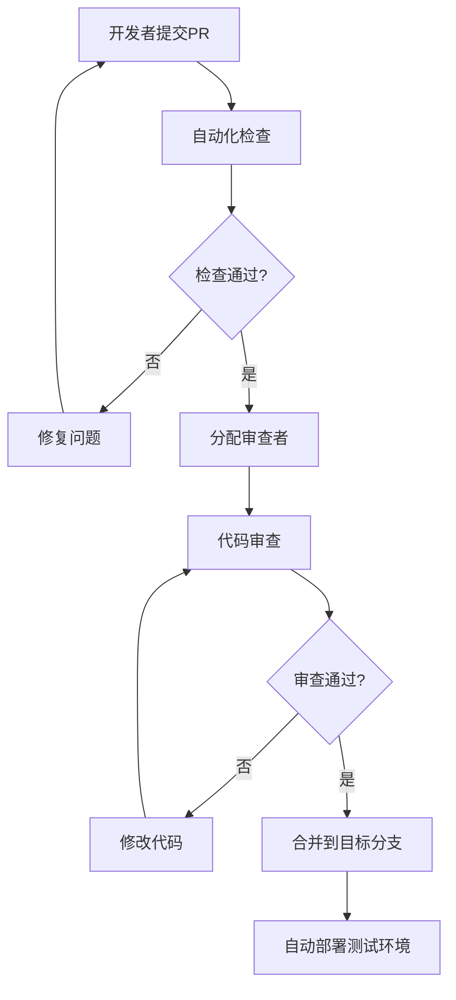

# 激光毁伤仿真系统开发流程与规范

## 1. 开发流程概述

### 1.1 敏捷开发流程
```
需求分析 → 架构设计 → 迭代开发 → 测试验证 → 部署发布 → 运维监控
    ↓         ↓         ↓         ↓         ↓         ↓
  2周      1周      8周      2周      1周      持续
```

### 1.2 迭代开发计划
- **Sprint 1 (2周)**: 核心框架搭建，ANSYS集成基础
- **Sprint 2 (2周)**: 激光毁伤仿真模块开发
- **Sprint 3 (2周)**: 毁伤后效分析模块开发  
- **Sprint 4 (2周)**: 数据分析与报告生成模块开发
- **Sprint 5 (2周)**: 毁伤效果评估模块开发
- **Sprint 6 (1周)**: GUI界面开发
- **Sprint 7 (1周)**: 集成测试与优化

## 2. 编码规范

### 2.1 Python编码规范 (基于PEP 8)

#### 2.1.1 命名规范
```python
# 类名：驼峰命名法
class LaserDamageSimulator:
    pass

class ThermalSolver:
    pass

# 函数和变量：下划线命名法
def calculate_thermal_damage():
    pass

def run_simulation():
    pass

laser_power = 1000.0
beam_diameter = 5.0

# 常量：全大写下划线分隔
MAX_SIMULATION_TIME = 3600
DEFAULT_LASER_WAVELENGTH = 1064.0
ANSYS_EXECUTABLE_PATH = "/opt/ansys_inc/v211/ansys/bin/ansys211"

# 私有方法和属性：单下划线前缀
def _validate_parameters(self):
    pass

self._internal_state = {}

# 特殊方法：双下划线包围
def __init__(self):
    pass

def __str__(self):
    pass
```

#### 2.1.2 文档字符串规范
```python
def run_simulation(self, parameters: dict) -> SimulationResult:
    """
    运行激光毁伤仿真
    
    Args:
        parameters (dict): 仿真参数字典，包含以下键值：
            - laser_parameters: 激光参数配置
            - material_parameters: 材料参数配置
            - environment_parameters: 环境参数配置
            - model_path: 3D模型文件路径
        
    Returns:
        SimulationResult: 仿真结果对象，包含温度场、应力场等数据
        
    Raises:
        SimulationError: 仿真执行失败时抛出
        ConfigurationError: 参数配置错误时抛出
        
    Example:
        >>> simulator = LaserDamageSimulator()
        >>> config = {
        ...     "laser_parameters": {"power": 1000, "wavelength": 1064},
        ...     "material_parameters": {"name": "aluminum_6061"},
        ...     "model_path": "models/plate.step"
        ... }
        >>> result = simulator.run_simulation(config)
        >>> print(f"最高温度: {result.max_temperature} K")
    """
    pass

class LaserConfiguration:
    """
    激光参数配置类
    
    该类用于封装激光器的各种参数设置，包括功率、波长、光斑大小等。
    所有参数都会进行有效性验证。
    
    Attributes:
        power (float): 激光功率，单位W，必须大于0
        wavelength (float): 激光波长，单位nm，常用值1064
        beam_diameter (float): 光斑直径，单位mm，必须大于0
        pulse_duration (float): 脉冲持续时间，单位s，默认0.001
        
    Example:
        >>> config = LaserConfiguration(
        ...     power=1000.0,
        ...     wavelength=1064.0,
        ...     beam_diameter=5.0
        ... )
        >>> config.validate()
        True
    """
    pass
```

#### 2.1.3 类型注解规范
```python
from typing import Dict, List, Optional, Union, Any, Tuple
import numpy as np
from pathlib import Path

def process_simulation_data(
    data: Dict[str, np.ndarray],
    output_path: Optional[Path] = None,
    format_options: Dict[str, Any] = None
) -> Tuple[bool, List[str]]:
    """处理仿真数据"""
    pass

class SimulationResult:
    """仿真结果类"""
    
    def __init__(self, 
                 simulation_id: str,
                 temperature_field: Optional[np.ndarray] = None,
                 stress_field: Optional[np.ndarray] = None):
        self.simulation_id: str = simulation_id
        self.temperature_field: Optional[np.ndarray] = temperature_field
        self.stress_field: Optional[np.ndarray] = stress_field
        self.metadata: Dict[str, Any] = {}
```

#### 2.1.4 代码格式规范
```python
# 行长度：最大88字符（Black格式化器默认）
# 缩进：4个空格
# 导入顺序：标准库 → 第三方库 → 本地模块

# 标准库
import os
import sys
import logging
from pathlib import Path
from typing import Dict, List, Optional

# 第三方库
import numpy as np
import pandas as pd
import matplotlib.pyplot as plt
from ansys.mapdl.core import launch_mapdl

# 本地模块
from .core.base_simulator import BaseSimulator
from .core.exceptions import SimulationError
from .utils.ansys_utils import AnsysConnector

# 函数定义间空两行
def function_one():
    pass


def function_two():
    pass

# 类定义间空两行
class ClassOne:
    pass


class ClassTwo:
    pass
```

### 2.2 代码质量要求

#### 2.2.1 质量指标
```yaml
code_quality_metrics:
  test_coverage: ">= 80%"
  cyclomatic_complexity: "<= 10"
  documentation_coverage: ">= 90%"
  type_annotation_coverage: ">= 95%"
  
  linting_scores:
    pylint: ">= 8.0/10"
    flake8: "0 errors"
    mypy: "0 errors"
    
  security_checks:
    bandit: "no high/medium issues"
```

#### 2.2.2 代码审查检查清单
```markdown
## 代码审查检查清单

### 功能性
- [ ] 代码实现符合需求规格
- [ ] 边界条件处理正确
- [ ] 错误处理完善
- [ ] 性能满足要求

### 代码质量
- [ ] 遵循编码规范
- [ ] 命名清晰有意义
- [ ] 函数职责单一
- [ ] 代码复用性好
- [ ] 注释充分准确

### 测试
- [ ] 单元测试覆盖率达标
- [ ] 测试用例充分
- [ ] 集成测试通过
- [ ] 性能测试通过

### 文档
- [ ] API文档完整
- [ ] 使用示例清晰
- [ ] 变更日志更新
- [ ] README更新

### 安全性
- [ ] 输入验证充分
- [ ] 敏感信息保护
- [ ] 权限控制正确
- [ ] 依赖库安全
```

## 3. 版本控制策略

### 3.1 Git分支模型 (Git Flow)

```
master (生产分支)
├── develop (开发分支)
│   ├── feature/laser-simulation (功能分支)
│   ├── feature/post-damage-analysis
│   ├── feature/data-analysis
│   ├── feature/damage-assessment
│   └── feature/gui-interface
├── release/v1.0.0 (发布分支)
├── release/v1.1.0
└── hotfix/critical-bug-fix (热修复分支)
```

### 3.2 分支命名规范
```bash
# 功能分支
feature/功能名称
feature/laser-power-control
feature/thermal-analysis-optimization

# 修复分支
bugfix/问题描述
bugfix/ansys-connection-timeout
bugfix/memory-leak-in-solver

# 发布分支
release/版本号
release/v1.0.0
release/v1.1.0

# 热修复分支
hotfix/紧急修复描述
hotfix/license-server-crash
hotfix/security-vulnerability
```

### 3.3 提交信息规范 (Conventional Commits)
```bash
# 格式：<类型>[可选范围]: <描述>
# [可选正文]
# [可选脚注]

# 功能添加
feat: 添加激光功率自适应调节功能
feat(laser): 实现多波长激光支持
feat(gui): 添加实时仿真进度显示

# 问题修复
fix: 修复ANSYS许可证连接超时问题
fix(solver): 解决热传导求解器内存泄漏
fix(data): 修复温度场数据导出格式错误

# 文档更新
docs: 更新API文档和使用示例
docs(readme): 添加安装指南
docs(api): 完善LaserDamageSimulator类文档

# 代码重构
refactor: 重构热求解器架构
refactor(utils): 优化ANSYS连接器代码结构

# 性能优化
perf: 优化大模型网格生成算法
perf(solver): 提升热传导计算效率50%

# 测试相关
test: 添加激光参数验证单元测试
test(integration): 完善ANSYS集成测试用例

# 构建相关
build: 更新依赖库版本
build(docker): 优化容器镜像大小
chore: 更新开发工具配置
```

### 3.4 版本号规范 (Semantic Versioning)
```
版本格式：主版本号.次版本号.修订号 (MAJOR.MINOR.PATCH)

主版本号：不兼容的API修改
次版本号：向下兼容的功能性新增
修订号：向下兼容的问题修正

示例：
v1.0.0 - 首个正式版本
v1.1.0 - 添加新功能，向下兼容
v1.1.1 - 修复bug，向下兼容
v2.0.0 - 重大架构变更，不向下兼容

预发布版本：
v1.0.0-alpha.1 - Alpha版本
v1.0.0-beta.1  - Beta版本
v1.0.0-rc.1    - Release Candidate版本
```

## 4. 代码审查流程

### 4.1 审查流程


### 4.2 审查角色分工
```yaml
review_roles:
  peer_reviewer:
    - 同级开发者
    - 检查代码逻辑和规范
    - 至少1人审查
    
  senior_reviewer:
    - 高级开发者/技术负责人
    - 检查架构设计和性能
    - 关键模块必须审查
    
  domain_expert:
    - 领域专家
    - 检查算法正确性
    - 仿真相关代码必须审查
    
  security_reviewer:
    - 安全专家
    - 检查安全漏洞
    - 涉及外部接口时审查
```

### 4.3 审查工具配置
```yaml
# .github/pull_request_template.md
name: Pull Request Template
about: 标准PR模板

## 变更描述
简要描述本次变更的内容和目的

## 变更类型
- [ ] 新功能 (feature)
- [ ] 问题修复 (bugfix)
- [ ] 性能优化 (performance)
- [ ] 代码重构 (refactor)
- [ ] 文档更新 (docs)
- [ ] 测试相关 (test)

## 测试
- [ ] 单元测试通过
- [ ] 集成测试通过
- [ ] 手动测试完成
- [ ] 性能测试通过 (如适用)

## 检查清单
- [ ] 代码遵循项目规范
- [ ] 添加了必要的测试
- [ ] 更新了相关文档
- [ ] 通过了所有自动化检查

## 相关Issue
关联的Issue编号: #

## 截图 (如适用)
如果有UI变更，请提供截图

## 其他说明
其他需要审查者注意的事项
```

## 5. 持续集成/持续部署 (CI/CD)

### 5.1 CI/CD流水线
```yaml
# .github/workflows/ci.yml
name: CI/CD Pipeline

on:
  push:
    branches: [ main, develop ]
  pull_request:
    branches: [ main, develop ]

jobs:
  test:
    runs-on: ubuntu-latest
    strategy:
      matrix:
        python-version: [3.8, 3.9, 3.10]
    
    steps:
    - uses: actions/checkout@v3
    
    - name: Set up Python
      uses: actions/setup-python@v3
      with:
        python-version: ${{ matrix.python-version }}
    
    - name: Install dependencies
      run: |
        pip install -r requirements.txt
        pip install -r requirements-dev.txt
    
    - name: Lint with flake8
      run: flake8 src/ tests/
    
    - name: Type check with mypy
      run: mypy src/
    
    - name: Security check with bandit
      run: bandit -r src/
    
    - name: Run tests
      run: pytest --cov=src/ --cov-report=xml
    
    - name: Upload coverage
      uses: codecov/codecov-action@v3
      with:
        file: ./coverage.xml

  build:
    needs: test
    runs-on: ubuntu-latest
    if: github.ref == 'refs/heads/main'
    
    steps:
    - uses: actions/checkout@v3
    
    - name: Build Docker image
      run: docker build -t laser-simulation:latest .
    
    - name: Push to registry
      run: |
        echo ${{ secrets.DOCKER_PASSWORD }} | docker login -u ${{ secrets.DOCKER_USERNAME }} --password-stdin
        docker push laser-simulation:latest
```

### 5.2 质量门禁
```yaml
quality_gates:
  code_coverage: ">= 80%"
  security_scan: "no high/critical issues"
  performance_test: "response_time < 30s"
  integration_test: "all tests pass"
  
blocking_conditions:
  - "test failure"
  - "security vulnerability"
  - "coverage below threshold"
  - "linting errors"
```

---

**文档版本**: v1.0  
**创建日期**: 2024-01-01  
**适用范围**: 激光毁伤仿真系统开发团队
